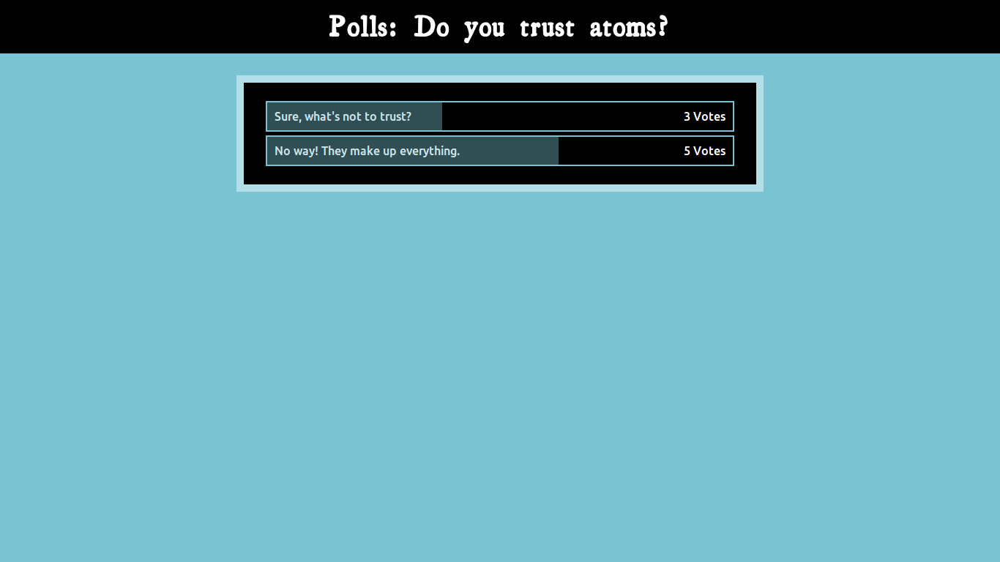

Django - Poll App
=================

Django poll app as taught in django docs

Usage
=====

- Clone the repo
- install sqlite3: `sudo apt-get install sqlite3`
- run `django syncdb` to create database
- run `python populate.py` to fill database with sample polls

ScreenShots
==========

____________

_________

